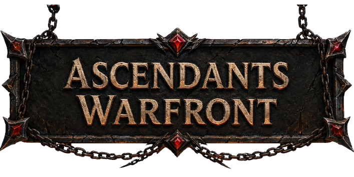

# Ascendants Warfront

A lane-based tactical card battler. Deploy units across three lanes, manage mana and gold, and destroy the enemy Nexus before yours falls.



## Play locally

```bash
npm install
npm run dev
```

Open the URL shown in the terminal (typically `http://localhost:5173`).

## Documentation

Full game mechanics, unit roster, spells, and strategy:

**[→ Game Guide (docs/GAME_GUIDE.md)](docs/GAME_GUIDE.md)**

Topics covered:

- Core gameplay loop and turn structure
- Combat, lanes, and Nexus damage
- Mana, gold, and shop economy
- All 10 unit tiers and archetypes (Aggressor, Defender, Balanced, Titan)
- Spell reference and strategy tips

## Tech stack

- React 19 + TypeScript
- Vite 7
- Tailwind CSS 4

## Project structure

```
src/App.tsx          — Game logic, card library, UI
public/images/       — Card art and battlefield assets
docs/GAME_GUIDE.md   — Player-facing game documentation
```
