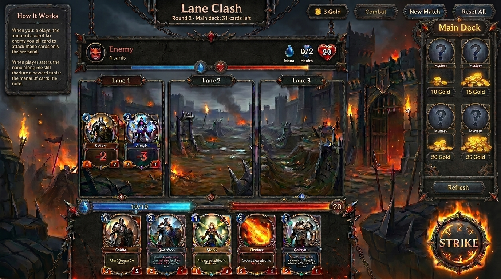

# Ascendants Warfront — UI Guidelines

This document is the **primary visual and layout reference** for all UI work on the project. Every screen change should move the live game closer to the mockup below.

---

## Reference mockup (target UI)

**File:** `public/images/referenceGame.png`



> Keep this image open while developing. When in doubt about placement, framing, or tone, match the mockup first — then align with the mechanics in [GAME_GUIDE.md](./GAME_GUIDE.md).

---

## Design vision

| Aspect | Direction |
|--------|-----------|
| **Genre feel** | Dark fantasy / medieval warfare |
| **Mood** | Burning castle siege — gritty, high stakes, tactile |
| **UI shell** | Ornate stone and weathered metal frames, spikes, chains, rivets |
| **Readability** | Strong contrast on stats; glow on interactive and damage states |
| **Platform** | Desktop-first battle layout; responsive collapse on small screens |

The mockup title reads **"Lane Clash"** — that is the in-game product name shown in the header until rebranded to Ascendants Warfront.

---

## Screen layout

The battlefield is a **three-column grid** with side panels. Zones map to the reference as follows:

```
┌─────────────────────────────────────────────────────────────────┐
│  HEADER — title, round/deck info, gold, phase, match controls   │
├──────────────┬──────────────────────────────┬───────────────────┤
│              │  ENEMY STRIP — avatar, deck, │                   │
│  HOW IT      │  mana bar, nexus (health)    │   MAIN DECK       │
│  WORKS       ├──────────────────────────────┤   (shop)          │
│  (left       │  LANE 1  │  LANE 2  │ LANE 3│   mystery backs   │
│  panel)      │  enemy   │  enemy   │ enemy │   + gold prices   │
│              │  ────────┼──────────┼───────│   + Refresh       │
│              │  player  │  player  │ player│                   │
│              ├──────────────────────────────┤                   │
│              │  PLAYER STRIP — mana bar,    │                   │
│              │  nexus bar, hand, STRIKE btn   │                   │
└──────────────┴──────────────────────────────┴───────────────────┘
```

### Zone responsibilities

| Zone | Reference behavior | Implementation notes |
|------|-------------------|----------------------|
| **Header** | Centered title; round + main deck count; gold pill; Combat / New Match / Reset All | Title should feel engraved/metallic; controls use stone-button styling |
| **Enemy strip** | Demon avatar, hand size, horizontal **mana** (blue) and **nexus** (red) bars | Prefer full-width bars over compact badges |
| **Lanes (×3)** | Tall vertical frames; "Lane N" label; unit cards inside; combat `-N` overlays | Frames use dark metal + spike motifs; lane bg shows battlefield ruins |
| **Player strip** | Wide mana + nexus bars; hand row; prominent **STRIKE** (End Turn) with fire ring | STRIKE is the primary CTA — largest, brightest, bottom-right |
| **How It Works** | Left stone scroll panel; short bullet rules | Decorative border; muted body text |
| **Main Deck** | Right vertical shop; 4 face-down cards with gold price; Refresh below | Card backs show ornate emblem + "MYSTERY" + price tag |

---

## Color palette

Extract from the reference and use consistently:

| Token | Role | Reference | Suggested hex |
|-------|------|-----------|---------------|
| `--bg-deep` | Page backdrop | Burning castle sky | `#0a0a0f` |
| `--frame-stone` | Panel / lane borders | Dark carved stone | `#2a2520` |
| `--frame-metal` | Card frames, buttons | Iron + bronze trim | `#4a4035` / `#8b6914` |
| `--mana` | Mana bar, cost gems | Cool blue glow | `#3b82f6` → `#1d4ed8` |
| `--nexus` | Health / nexus bars | Blood red | `#dc2626` → `#7f1d1d` |
| `--gold` | Currency, highlights | Warm amber | `#f59e0b` |
| `--fire` | STRIKE button, torches | Orange flame | `#f97316` → `#ea580c` |
| `--damage` | Combat numbers | Bright red pop | `#ef4444` |
| `--text-primary` | Titles, stats | Off-white | `#f1f5f9` |
| `--text-muted` | Rules, labels | Warm gray | `#94a3b8` |

**Enemy units:** rose/red tint overlay on card art.  
**Player units:** sky/blue tint overlay — keeps sides readable at a glance.

---

## Typography

| Use | Style in reference | Guideline |
|-----|-------------------|-----------|
| Game title | Bold serif, metallic | Large, centered, slight letter-spacing |
| Lane labels | Small caps, tracked | `LANE 1`, `LANE 2`, `LANE 3` |
| Card names | Gothic / fantasy serif on nameplate | Upper third of card, on stone plaque |
| Card stats | Bold sans, high contrast | Bottom corners in colored shields (⚔ left, ♥ right) |
| Rules panel | Decorative but legible | 10–12px body; amber/gold section headers |
| Buttons | Bold caps | `STRIKE`, `REFRESH`, `NEW MATCH` |

Prefer one display serif (titles/cards) + one UI sans (stats, buttons). Avoid generic system-only stacks long term.

---

## Components

### 1. Card (hand & board)

Target anatomy from the reference:

```
┌─────────────────────┐
│ ◆3              TYPE│  ← mana cost (top-left), type badge (top-right)
│                     │
│    [illustration]   │  ← full-bleed art from /images/card_{id}.jpg
│                     │
│ ┌─────────────────┐ │
│ │   CARD NAME     │ │  ← stone nameplate
│ └─────────────────┘ │
│ ⚔3            ♥2   │  ← attack (amber), health (green/red)
└─────────────────────┘
   ornate metal frame
```

**Rules:**
- Art fills the card; stats sit above art with drop shadow.
- Mana cost in a gem or circular badge (top-left).
- Unit vs spell: spell shows effect text instead of ⚔/♥ where applicable.
- Board units use the same card chrome as hand cards (reference shows full cards in lanes).

**Assets:** `public/images/card_{id}.jpg` for each unit id (`scout`, `acolyte`, …).

### 2. Lane frame

- Vertical rectangle taller than wide.
- Outer border: layered stone + metal spikes (reference shows chains on sides).
- Inner area: semi-transparent battlefield (`bg_battlefield.png` or lane-specific crop).
- Empty slot: dashed inner frame, subtle "—" or placement hint.
- Active target: amber glow on frame (deploy / move / cast).

### 3. Resource bars (mana & nexus)

Reference uses **horizontal bars**, not small pills:

```
Mana:  ████████████░░░░  10/10   (blue fill, dark track)
Nexus: ████████████████  20      (red fill, dark track)
```

- Place enemy bars in the top strip; player bars above the hand.
- Flash or pulse bars when values change (combat, spells, round rewards).
- Icons: blue droplet/gem for mana; red heart for nexus HP.

### 4. STRIKE button (End Turn)

The mockup's **STRIKE** button is the visual anchor of the player area:

- Large circular control, bottom-right of hand row.
- Metal ring + **animated fire** on the outer edge.
- Label: **STRIKE** (maps to current "End Turn" action).
- Disabled state: dim metal, no fire, no pointer.

### 5. Shop card (Main Deck)

- Face-down ornate back (purple/indigo gradient + gold emblem in reference).
- **Only price visible** before purchase (gold coin + number).
- After buy: flip/reveal animation → card joins hand with bounce (already partially implemented).
- `Refresh` as a stone button under the four slots; show uses remaining (3 per round).

### 6. Header controls

| Control | Reference label | Behavior |
|---------|------------------|----------|
| Phase badge | `Combat` | Shows current phase (Your Turn / Enemy / Combat) |
| | `New Match` | Restarts match, keeps gold + deck |
| | `Reset All` | Full progress reset |

Style: rectangular stone/metal buttons, subtle hover brighten.

### 7. Combat feedback

From Lane 1 in the reference:

- Floating **`-N`** damage numbers centered on cards during clash.
- Red ring or flash on units taking damage.
- Death: fade + slight blur/scale down (current behavior is close).
- Nexus damage: bar drains with animated tick (partially implemented).

### 8. How It Works panel

- Left column on large screens; collapsible below battle on mobile.
- Stone/scroll texture background (`card_acolyte.jpg` overlay acceptable).
- Bullet list of core rules — keep in sync with [GAME_GUIDE.md](./GAME_GUIDE.md).

---

## Background & assets

| Asset | Path | Usage |
|-------|------|--------|
| Battlefield | `public/images/bg_battlefield.png` | Full-page backdrop |
| Reference mockup | `public/images/referenceGame.png` | **UI target — do not ship in-game** |
| Game logo | `public/images/game_logo.png` | Title screen / README / future splash |
| Unit art | `public/images/card_{id}.jpg` | Cards and lane units |

When adding a new unit, add matching `card_{id}.jpg` before merging UI work.

---

## Responsive behavior

| Breakpoint | Layout |
|------------|--------|
| **≥ lg** | 3-column: How It Works (optional left) · battle · Main Deck right — matches mockup |
| **< lg** | Stack: battle first, shop second, rules third |
| Hand | Horizontal scroll if cards overflow; never clip mana/STRIKE |

Maintain minimum touch targets (44px) on lane clicks and STRIKE.

---

## Motion & interaction

| Event | Motion |
|-------|--------|
| Card select | Lift + scale (`-translate-y`, ring) |
| Lane target | Amber border pulse |
| Buy card | Bounce on new hand card |
| Combat clash | Damage numbers bounce |
| Nexus hit | Bar flash + numeric drain animation |
| STRIKE hover | Fire intensifies, slight scale |
| Toast | Bottom-center pill (already implemented) |

Keep durations **300–700ms** for UI; combat showcase **1–1.6s** (see `T` constants in `src/App.tsx`).

---

## Implementation checklist

Use this when reviewing UI PRs. Goal: close gaps between live app and reference.

- [ ] Header: centered title treatment matching mockup weight
- [ ] Enemy/player **resource bars** (replace compact badge-only layout)
- [ ] Lane frames: ornate metal/stone borders + spike/chain detail
- [ ] In-lane cards use full card chrome from reference
- [ ] Hand cards: nameplate + corner stat shields like mockup
- [ ] **STRIKE** button with circular fire treatment (rename from "End Turn" optional)
- [ ] Shop backs: ornamental mystery design + prominent gold price
- [ ] How It Works: left stone panel on desktop
- [ ] Global dark-fantasy palette tokens (reduce flat Tailwind slate defaults)
- [ ] Typography: fantasy display font for titles/card names

**Current baseline:** `src/App.tsx` implements correct **layout zones and game flow** but uses a flatter, modern Tailwind aesthetic. Treat the reference as the visual finish line.

---

## Do's and don'ts

### Do

- Match spacing and hierarchy from `referenceGame.png` before adding new widgets.
- Reuse existing image assets under `public/images/`.
- Keep mana (blue), nexus (red), and gold (amber) color meanings consistent.
- Test combat phase at Round 2+ so damage overlays and bars are visible.

### Don't

- Introduce bright flat Material-style cards that break the medieval frame language.
- Hide gold price on shop cards — price is the main purchase cue in the mockup.
- Move STRIKE / End Turn to a low-contrast text link.
- Use the reference PNG as an in-game background — it is documentation only.

---

## Related docs

- [GAME_GUIDE.md](./GAME_GUIDE.md) — mechanics, units, spells (content for How It Works)
- [../README.md](../README.md) — setup and project overview

---

*Last updated to reflect `public/images/referenceGame.png`. Update this file when the mockup changes.*
